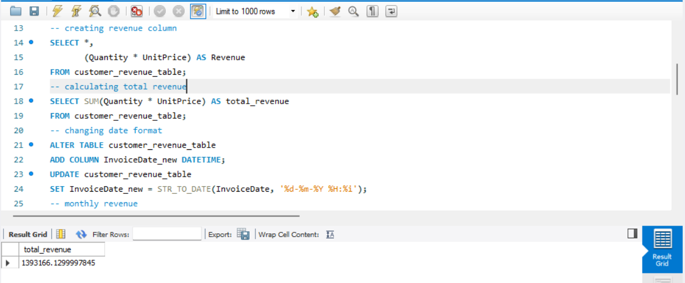
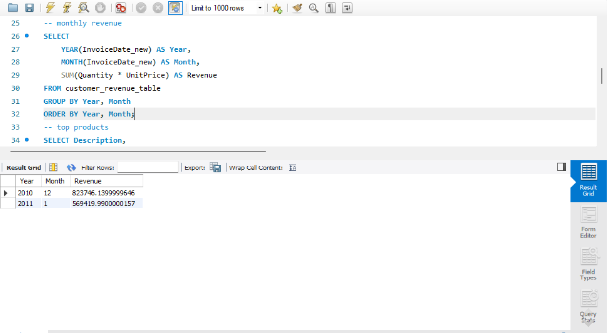
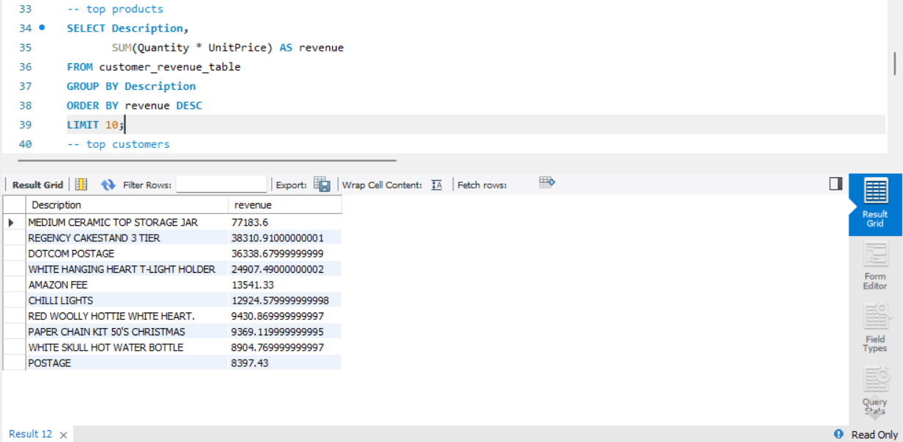
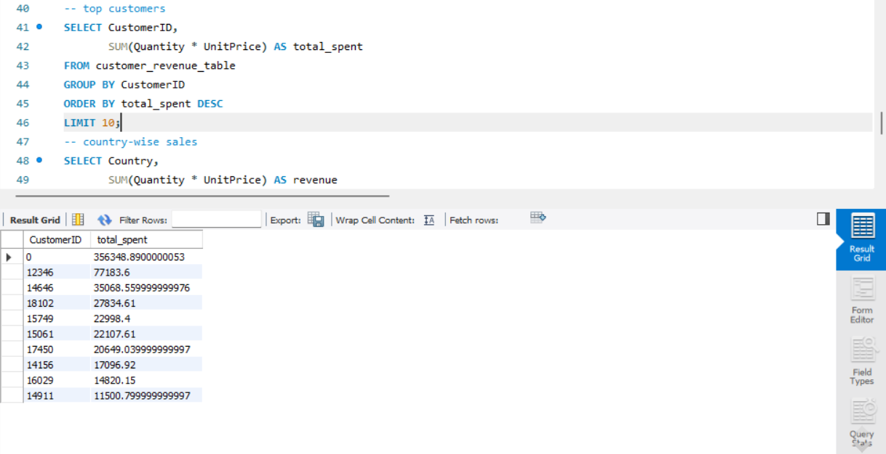
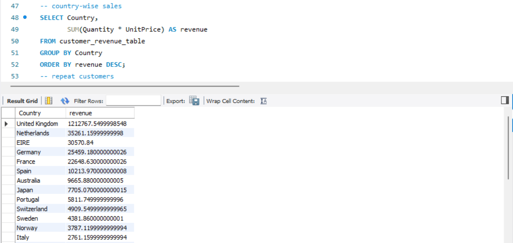
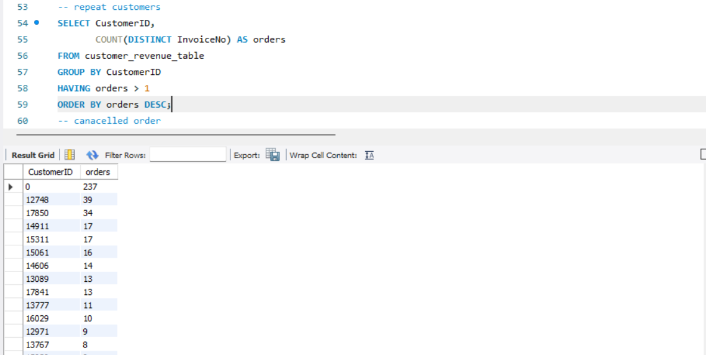

# Customer Behaviour and Sales Analysis using SQL

## 📌 Business Context
This project simulates the role of a Data Analyst analyzing retail transaction data to uncover insights on revenue trends, customer behavior, product performance, and geographic sales distribution.

The objective is to transform raw transactional data into meaningful business insights using SQL.

---

## 🛠 Tools & Skills Used
- SQL (MySQL)
- Data Cleaning & Transformation
- Aggregation & Grouping
- Business Analysis
- Data Interpretation

---

## 📊 Dataset

- **Source:** Kaggle – Online Retail Dataset  
- **Link:** https://www.kaggle.com/datasets/vijayuv/onlineretail  
- **Size:** 50,000+ transactions  
- **Description:**  
  UK-based online retail dataset containing transactional sales data.

- **Note:**  
  A sample dataset (100 rows) is included in this repository for demonstration purposes.

---

## 🗄️ Database Schema

The dataset structure is defined in `schema.sql`.

**Key Columns:**
- InvoiceNo — Transaction ID (prefix 'C' indicates cancellations)
- StockCode — Product ID
- Description — Product name
- Quantity — Number of items purchased
- InvoiceDate — Transaction date
- UnitPrice — Price per item
- CustomerID — Customer identifier
- Country — Customer location

---

## 🧹 Data Cleaning & Preparation

To ensure accurate analysis, the following steps were performed:

- Removed NULL `CustomerID`
- Removed `Quantity <= 0`
- Removed `UnitPrice <= 0`
- Converted `InvoiceDate` to DATETIME format
- Created a new column: **Revenue = Quantity × UnitPrice**

---

## 📈 Analysis & Insights

### Total Revenue

### Monthly Revenue Trends

### Top Products by Revenue

### Top Customers by Spending

### Revenue by Country

### Repeat Customers

---

## 🔍 Key Insights

- Revenue follows the **Pareto Principle**, where a small percentage of products and customers contribute the majority of revenue  
- Noticeable **seasonal trends** in monthly sales  
- High dependency on **top-performing products**  
- **Repeat customers** significantly contribute to overall revenue  
- Sales are concentrated in specific geographic regions  

---

## 💡 Business Recommendations

| Priority | Recommendation | Expected Impact |
|---------|--------------|----------------|
| High | Focus on retaining high-value customers | Increase long-term revenue |
| High | Promote top-performing products | Maximize sales efficiency |
| Medium | Run campaigns during peak months | Boost seasonal revenue |
| Medium | Expand into underperforming regions | Diversify revenue streams |
| Low | Optimize product mix | Reduce dependency on few products |

---

## 📁 Repository Structure

customer behaviour & sales analysis using sql/  
│  
├── data/  
│   └── sample_data.csv  
│  
├── queries/  
│   └── analysis.sql  
│  
├── screenshots/  
│   ├── country_analysis.png  
│   ├── monthly_revenue.png  
│   ├── repeat_customers.png  
│   ├── top_customers.png  
│   ├── top_products.png  
│   └── total_revenue.png  
│  
├── schema.sql  
├── README.md  

---

## 🚀 How to Use

1. Download the sample dataset from the `data/` folder  
2. Open MySQL or any SQL environment  
3. Run queries from `queries/analysis.sql`  
4. Modify queries to explore additional insights  

---

## 👩‍💻 Author

**Aiswarya KP**  
Aspiring Data Analyst  

- Email: aiswaryakp104@gmail.com  
- LinkedIn: https://www.linkedin.com/in/aiswarya-k-p  
- GitHub: https://github.com/Aiswaryakp799  

---

This project was built as part of my data analytics portfolio to demonstrate end-to-end analytics skills including SQL data cleaning, data transformation, aggregation, and business insight generation.